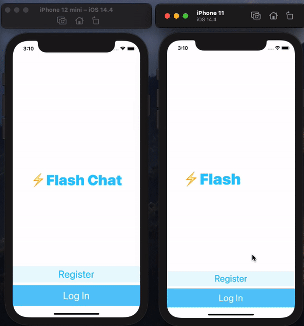

# FlashChat-iOS

## What I've practiced on this project

* Integrated third party libraries in app using Cocoapods and Swift Package Manager.
* Storted data in the cloud using Firebase Firestore.
* Used Firebase for user authentication, registration and login.
* Worked with UITableViews.
* Created custom views using .xib files to modify native design components.
* How to embed View Controllers in a Navigation Controller and understand the navigation stack.

